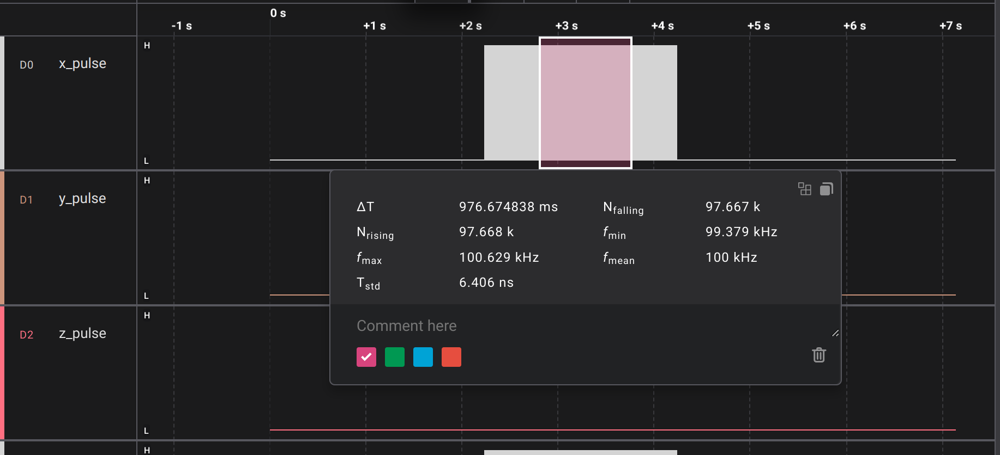

# stm32f7xx_grbl

[TOC]

## Introduction

This project is developed based on [GRBL](https://github.com/gnea/grbl) to support [stm32f767zi](https://www.st.com/en/microcontrollers-microprocessors/stm32f767zi.html) MCU. In order to support more features such as TCP communication  and encoder feedback, [FreeRTOS](https://www.freertos.org/) is implemented here. The differences are listed below.

## Differences

| Features             | GRBL             | STM32F7 GRBL        |
| -------------------- | ---------------- | ------------------- |
| Main Interface       | Serial           | TCP                 |
| RTOS                 | No               | Yes                 |
| Encoder Feedback     | No               | Yes                 |
| Extra User's Outputs | No               | Yes                 |
| Pulse Generation     | Time Interrupt   | Output Compare Mode |
| Pulse Frequency      | Less than 100KHz | At least 100KHz     |


## Pulse Generation Performance

Step pulses are generated by timer **Output Compare** channels driven by **DMA**, decoupled from the CPU through a pre-computed pulse ring buffer. The master timer is free-running and shared across axes; one DMA *transfer-complete* interrupt (on the dominant "tc" axis) paces the reload of the next buffer slot for all axes.

### Optimizations

The following work was done to reach and sustain the target pulse rate without underrunning the DMA pipeline:

- **Single-timer-counter (single-TC) architecture with a free-running master timer.** OC/DMA parameters are precomputed per axis so the hot path only writes registers; the master timer is never stopped mid-motion (only at true motion-end), avoiding restart/realign overhead between buffer reloads.
- **Reliable DMA stream restart for non-dominant axes.** The TC interrupt is enabled only on the dominant axis, so the HAL completion path that returns the channel/stream state to `READY` (and releases the DMA lock) never runs for the other axes. Their `hdma->State`, `hdma->Lock`, and TIM channel state are now explicitly reset before re-arming, so `HAL_DMA_Start_IT` no longer bails out with `HAL_BUSY` and freezes an axis (NDTR stuck at 0, CCR frozen).
- **Cortex-M7 instruction cache enabled** — the key throughput win. With the I-cache disabled, code executed straight from Flash with wait-states (`FLASH_LATENCY_7` @ 216 MHz), which made the per-tick pulse computation (`stepCalculatePulseData`) take **~5 µs** — about the same as the pulse width itself — starving the ring buffer at high step rates. Enabling `SCB_EnableICache()` cut it well below the pulse width and resolved the underrun.

### Measured Result

With the optimizations above, a sustained single-axis pulse train was captured with a logic analyzer over ~0.98 s (~97.7k pulses):



| Metric                     | Value          |
| -------------------------- | -------------- |
| Mean frequency (`f_mean`)  | **100 kHz**    |
| Min frequency (`f_min`)    | 99.379 kHz     |
| Max frequency (`f_max`)    | 100.629 kHz    |
| Period std. dev. (`T_std`) | **6.406 ns**   |
| Rising / falling edges     | 97.668k / 97.667k |
| Window (`ΔT`)              | 976.674838 ms  |

The very low period standard deviation (~6.4 ns) reflects the DMA/OC hardware timing path — pulse edges are driven by timer compare matches rather than by software, so CPU scheduling jitter does not appear in the output.

### Future Work

- **Enable the Cortex-M7 data cache (D-cache).** Currently left **disabled**: the pulse ring buffer is written by the CPU and read by DMA, and with no MPU non-cacheable region the DMA would read stale data. Enabling the D-cache would further speed up the data-side work but requires either an **MPU region** marking the DMA buffers non-cacheable, or explicit `SCB_CleanDCache_by_Addr()` maintenance before each buffer is consumed. This needs hardware verification of DMA coherency.
- **Hot-path micro-optimizations in `stepCalculatePulseData`.** De-volatile `currentCounterValue` into a local (write back once per call) to avoid forced memory accesses in the loop, remove debug-GPIO toggles from release builds, and optionally compute several Bresenham ticks per call to amortize the fixed per-call overhead.


## Commands

- `0xA2` - Read I/O status. The format of the response from GRBL is a string with an Hexidecimal string number inside, e.g. `[IO:0x0123]`, which denotes status of the 16 inputs and 16 outputs as an unsigned 32 bits number. The definition of each bit is as shown below. _NOTE: the newline symbol, `\r`, is not necessary here._

### I/O List

- Inputs
  - `bit 0`: PIN_X_LIMIT
  - `bit 1`: PIN_Y_LIMIT
  - `bit 2`: PIN_Z_LIMIT
  - `bit 3`: PIN_PROBE
  - `bit 4`: PIN_RESET
  - `bit 5`: PIN_FEED_HOLD
  - `bit 6`: PIN_CYCLE_START
  - `bit 7`: PIN_SAFETY_DOOR
- Outputs
  - `bit 16`: PIN_X_DIRECTION
  - `bit 17`: PIN_Y_DIRECTION
  - `bit 18`: PIN_Z_DIRECTION
  - `bit 19`: PIN_STEPPERS_DISABLE
  - `bit 20`: PIN_COOLANT_FLOOD
  - `bit 21`: PIN_SPINDLE_ENABLE
  - `bit 22`: PIN_SPINDLE_DIRECTION
  - `bit 23`: PIN_USER_OUTPUT_0
  - `bit 24`: PIN_USER_OUTPUT_1
  - `bit 25`: PIN_USER_OUTPUT_2
  - `bit 26`: PIN_USER_OUTPUT_3

## Control Output Status

- `M62 P[BitID]` - Set output pin specified by `BitID` as **ACTIVE**. `BitID` is defined in the [I/O List](#io-list). e.g. `M62 P23`, which activates output pin `PIN_USER_OUTPUT_0`.
- `M63 P[BitID]` - **DEACTIVE** output pin specified by `BitID`.

## Default Settings

| Config. ID | Desc.             | Default Value | Note                                                         |
| ---------- | ----------------- | ------------- | ------------------------------------------------------------ |
| 33         | IP_0              | 172           |                                                              |
| 34         | IP_1              | 16            |                                                              |
| 35         | IP_2              | 0             |                                                              |
| 36         | IP_3              | 10            | i.e. IP = 172.16.0.10                                        |
| 37         | TCP Port (Offset) | 0             | The base number is 8500.<br />If offset is 0, the listening port will be 8500. |
| 38         | MAC_0             | UID_0         | UID_0 is extracted from most significant byte of stm32 unique ID. |
| 39         | MAC_1             | UID_1         | 2nd byte of UID                                              |
| 40         | MAC_2             | UID_2         | 3rd byte of UID                                              |
| 41         | MAC_3             | UID_3         | 4th byte of UID                                              |
| 42         | MAC_4             | UID_4         | 5th byte of UID                                              |
| 43         | MAC_5             | UID_5         | 6th byte of UID                                              |


## Already Known Issues

### Output an unwanted spike during setting OC mode

When setting the output compare mode for an output pin at run-time, e.g. toggle, active, inactive, we observed unwanted spikes occasionally occurring after setting the OC mode to toggle. In this failure case, the open-drain is selected as the output configuration to create the sink logic required by the stepper driver. The polarity is configured as **Active HIGH** which means the output turns into HIGH state when the OCx is active. For the sink logic, a pull up resistor is necessary to avoid the floating state of the output. So, it is obvious that the output will stay in HIGH when the OCx is not configured or disabled.

Unfortunately, during the OC setting process, it needs a reset procedure before configuring OC mode to a particular mode. This action will also make output become HIGH. After the configuration, OCx has to be enabled again, which in turn forces the OCx to LOW (**Inactive**).

In a nutshell, if the OC was inactive, the output stay in Low. When it needs to be re-enabled with toggle mode, the output state will go from low to high over the reset procedure, and then going from high to low once re-enabling. This generates a sharp spike which might drive stepper one step.

```shell
Given - Polarity: Active High
[OCx Output]  (spike)↓
HIGH                 _     ____
                    | |   |    |
                    | |   |    |
LOW        _________| |___|    |______

[OCx State]
ACTIVE                     ____
                          |    |
                          |    |
INACTIVE   _______________|    |______

[OCx Config]
ENABLED    ________   ________________
                   | |
                   | |
DISABLED           |_|
```


In order to address this issue, the **polarity** shall be set to **Active LOW**, by doing so, the inactive output state (**HIGH**) will align with disabled state (**HIGH**) even during the transition of re-enabling. After all, the unwanted spikes are disappeared.

## Troubleshooting

### Forget Current IP and Port Settings

The workaround to address this issue is temporarily using default IP and Port settings by pressing on-board user button before reseting the board for at least 10 sec. When default settings are chosen successfully, the on-board user's LEDs (**LD1** and **LD2**) will start blinking.

At this point in time, users can communicate to system with default TCP settings. (i.e. `172.16.0.10:8500`)
